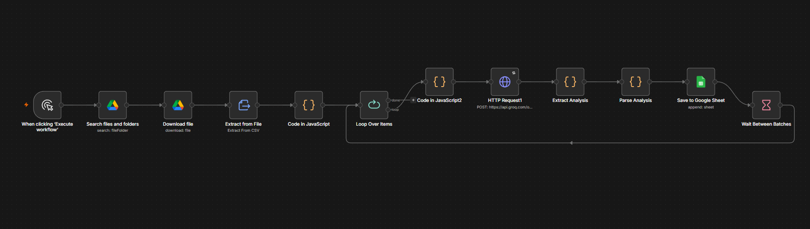

# 🛒 Blinkit — Next Leap

This repository contains two main projects:
1. 🧠 **[Blinkit AI Discovery Engine](./Blinkit%20AI%20Discovery%20Engine)**: An AI-powered PM research tool & RAG engine (FastAPI, ChromaDB, BGE embeddings, Groq, React frontend) for analyzing category exploration barriers.
2. ⚡ **n8n Automation Workflow**: An automated batch-processing review analysis pipeline (`workflow.json`, `samplereview.csv`, `image.png`).

---

## 📁 Repository Structure

```
Blinkit--Next-Leap/
├── Blinkit AI Discovery Engine/   # FastAPI + ChromaDB + React RAG Engine
│   ├── apps/
│   │   ├── api/                   # Backend FastAPI service
│   │   └── web/                   # Frontend React application
│   ├── Dockerfile                 # Docker configuration
│   └── README.md                  # Discovery Engine detailed documentation
├── workflow.json                  # n8n workflow definition
├── samplereview.csv               # Sample review dataset
├── image.png                      # n8n workflow diagram
└── README.md                      # Root documentation
```

---

## 🧠 Blinkit AI Discovery Engine

The complete full-stack discovery engine application is located in the **[`Blinkit AI Discovery Engine`](./Blinkit%20AI%20Discovery%20Engine)** directory. 

For quick start, API specs, and setup instructions, please see the **[Blinkit AI Discovery Engine README](./Blinkit%20AI%20Discovery%20Engine/README.md)**.

---

## ⚡ n8n Workflow Automation

An end-to-end review intelligence pipeline built with [n8n](https://n8n.io/). It automatically ingests raw Blinkit customer reviews from Google Drive, cleans and preprocesses text, sends batches to **Groq's LLaMA 3.3-70B** model for deep product analysis, and stores the structured insights in a Google Sheet.


